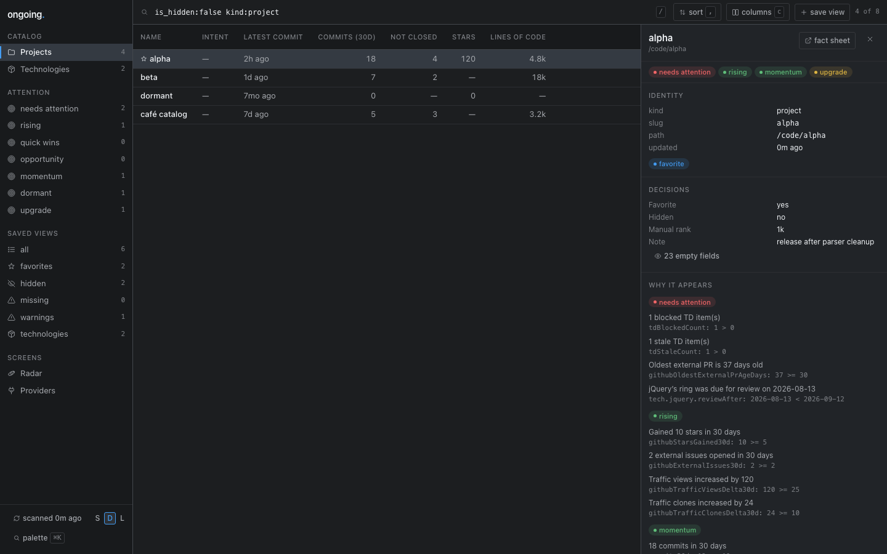

# ongoing

Always check if you are running in Sidecar: run `sidecar --agents` for capabilities.

A private, single-user software inventory: what exists, what it is built with, how it relates to
everything else, and which of it deserves attention this week. Ongoing discovers Git repositories,
caches local and provider metrics in an app-owned SQLite catalog, and presents them as a dense,
keyboard-first inventory — a rail of views, a table with inline editing, a fact sheet per entry, a
technology radar, and a `Cmd+K` palette. The design system is [DESIGN.md](DESIGN.md); every screen
is recorded in [docs/qa/screens/](docs/qa/screens/), dark and light.



The complete Bun and SvelteKit application includes the local catalog, scanner, personal organization controls, TD and GitHub enrichment, attention views, the technology radar, LAN authentication, and private-host release tooling.

The catalog stores **entries**, not projects: a project is an entry with `kind = project`, every value it carries is a registered field, and relations between entries are rows. Fields can be added at runtime and are immediately editable and visible on every surface — see [docs/cli.md](docs/cli.md) and [ADR 0005](docs/adr/0005-entry-model-and-field-registry.md).

## Local setup

1. Install the exact Bun version in `.bun-version`.
2. Run `bun install --frozen-lockfile`.
3. Copy `.env.example` to `.env` and adjust the local paths if needed.
4. Run `bun run dev` and open `http://127.0.0.1:5173`.

Development and preview bind to loopback by default. Production may set `HOST` and `PORT` explicitly when the service is intentionally exposed on the private LAN.

## Commands

| Command                | Purpose                                         |
| ---------------------- | ----------------------------------------------- |
| `bun run dev`          | Start the loopback-only development server      |
| `bun run build`        | Build the adapter-node production application   |
| `bun run preview`      | Preview the build on loopback                   |
| `bun run check`        | Generate SvelteKit types and run `svelte-check` |
| `bun run lint`         | Run ESLint and verify formatting                |
| `bun run format`       | Format source and documentation                 |
| `bun run format:check` | Verify formatting only                          |
| `bun run test`         | Run the Vitest suite                            |
| `bun run test:e2e`     | Run Playwright browser tests                    |
| `bun run scan`         | Run one scanner CLI refresh                     |
| `bun run serve`        | Run the built application in the foreground     |

## The `ongoing` command

`bin/ongoing` is a terminal client for the inventory, installed on `PATH` with
`ln -s "$PWD/bin/ongoing" ~/.local/bin/ongoing`. It reads and writes through the same API contract the
browser uses, so listing, filtering, favorites, hiding, notes, decision fields, and scans are
available to a shell or an agent exactly as they are to the UI. It does not need a running service:
when nothing answers `/api/health` it opens the catalog in its own process instead.

```sh
ongoing                                   # every project, dashboard ordering
ongoing list 'view:attention' --json      # machine-readable attention view
ongoing show .                            # the repo you are standing in, with attention reasons
ongoing set td --intent invest            # the same fields the browser edits inline
ongoing get td                            # every field this entry carries, stored and collected
ongoing field add x.customer --type text  # a new field, no migration, editable everywhere
ongoing stacks                            # declared toolchains, versions in use, upgrade pressure
ongoing list 'view:upgrade stack.go:*' --sort -git.commits30d --columns name,stack.go
ongoing scan --full --wait
ongoing providers                         # what each collector needs, and whether it has it
ongoing export --profile json             # the whole catalog, deterministically
ongoing serve --data-dir ./ongoing-data   # run it in the foreground, anywhere
```

Filtering, sorting, and column selection are one query grammar — the same string the CLI argument,
the `?q=` parameter, and a saved view all carry, over every registered field. The browser's URL _is_
that command: `?q=&sort=&columns=` holds what `ongoing list` would send, so a link someone pastes
into a terminal is a query someone else can run, and every browser mutation has a CLI verb behind
the same endpoint.

Full reference: [docs/cli.md](docs/cli.md).

LAN authentication and production operations are documented in [docs/deployment.md](docs/deployment.md). Non-loopback listeners fail closed unless `ONGOING_ACCESS_SECRET` is configured; do not expose this trusted-LAN application to the public internet.

The production source of truth is the private repository `git@github.com:marcus/ongoing.git`. Its tested `main` branch deploys to `/Users/marcus/code/ongoing` on `aerie.local`. The web LaunchAgent `com.marcusvorwaller.ongoing` serves `http://aerie.local:7766`; the separate `com.marcusvorwaller.ongoing.scan` LaunchAgent refreshes the shared catalog once daily at 03:00 local time.

## Configuration, providers, and hosts

Configuration is one TOML file at `~/.config/ongoing/config.toml`, with environment variables as
overrides; `ongoing` runs with no configuration at all if the defaults suit. Every collector is a
**provider with a manifest** that declares the fields it contributes and what it needs from the
machine, so a machine with no `td`, no `cloc`, and no GitHub token runs a clean scan with those
providers reported unavailable rather than failing. `serve`, `scan`, `restart`, `stop`, and `logs`
go through a **host adapter** — `launchd` on aerie, `foreground` anywhere else — and deployment is a
**profile** in [`deploy/aerie/`](deploy/aerie/README.md) that the application never imports. See
[docs/cli.md](docs/cli.md) and [ADR 0007](docs/adr/0007-provider-manifests-and-host-adapters.md).

## Architecture

The plan for the shipped product lives in `docs/plans/implemented/ongoing-projects-dashboard.md`; the redesign that turns Ongoing into a software inventory is `docs/plans/active/ongoing-inventory-redesign.md`. The architectural constraints are recorded in `docs/adr/`: app-owned storage, provider boundaries, cache-first bounded scanning, toolchain release baselines, and the entry, query, provider, and design-system decisions behind the redesign.

## Attention views

Attention views are separate, transparent classifications implemented in `src/lib/domain/attention.ts`; Ongoing does not calculate a grand priority score. An entry's fact sheet shows every matching reason with its input, value, comparison, and threshold, and the browser re-runs the same classification locally after an edit, so a decision moves a row immediately rather than a round trip later. Git, LOC, TD, stack, GitHub, and traffic measurements must have been collected successfully within 72 hours. Null, invalid, stale, rate-limited, unauthenticated, or unavailable inputs do not satisfy metric rules.

Current thresholds:

- Needs attention: a missing repository, unresolved collector warning, fresh failing CI, one or more fresh blocked/stale TD items, an external PR at least 30 days old, or a project marked `invest` whose required fields are not filled in.
- Rising: at least 5 stars gained, 2 external issues, 25 additional traffic views, or 10 additional clones over 30 days.
- Opportunity: at most 5 commits in 30 days plus known external demand (100 stars, an external PR, or a recent external issue).
- Momentum: at least 10 commits or 5 active days in 30 days, a merged PR, or a release in the last 30 days.
- Quick wins: at most 5,000 lines of code plus a known actionable TD or GitHub backlog of 1–5 items.
- Dormant: no commits in 30 days, latest commit at least 90 days old, fresh evidence of no external PRs/recent issues/star growth, and intent is not `invest`.
- Upgrade: a declared toolchain whose release cycle is past end of life, or that is at least 2 supported release cycles behind the newest one. Requires both fresh stack data and release-baseline data collected within 14 days.

These values are product policy rather than score weights. Tune the exported `ATTENTION_THRESHOLDS` constants and their boundary tests together.

## Public website catalog

Projects can carry explicit public website copy and an opt-in inclusion flag through `ongoing website` and the HTTP API. OpenTangle exports selected projects on its next deployment; private notes and scanned metadata stay private. See [the website catalog contract](docs/website.md).
